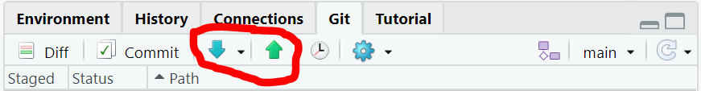

```{r klippy, echo=FALSE, include=TRUE}
klippy::klippy(
  lang = c("r", "markdown", "bash"),
  all_precode = FALSE,
  position = c("top", "left"),
  color = "auto",
  tooltip_message = "Copy code",
  tooltip_success = "Copied!"
)
```

# Introduction

Being able to track changes, revert to previous versions, and collaborate efficiently are important parts of reproducibility and transparency. In this chapter, we will explore how to add those elements to your workflow using Git and GitHub. Git is a version control software installed locally, and GitHub is a cloud-based system to store and share your work online.

## Learning Outcomes

-   Create a repository to track changes and version history locally using Git.
-   Use branches (copies) to work on a documents in a repository without changing the master.
-   Use GitHub to store a repository remotely.
-   Become familiar with the basics of using GitHub for file sharing and collaboration.

## Resources

The following resources have similar information and each will get you to roughly the same place, though the approach is different. I found it helpful to go through several as some have explanations or examples that are unique and helped me have a more well-rounded understanding of the concepts.

-   This chapter is largely based off of chapter 5 in @Gandrud_2015.
-   [Happy Git With R](https://happygitwithr.com/index.html) provides a good starter guide with a few different approaches depending on your needs.
-   [This GitHub Doc](https://docs.github.com/en/get-started/quickstart) focuses more on using GitHub.
-   [Oh S#!\*, Git!?!](https://ohshitgit.com/) provides tools for when mistakes are made (e.g., committing to the wrong branch) and how to fix them in the terminal (See the section [Install a Git Client] to do these things using a graphic user interface). Note: this page contains a lot of swear words.
-   [This article](https://www.pluralsight.com/blog/software-development/the-definitive-guide-to-forks-and-branches-in-git#:~:text=Forking%20creates%20a%20full%20copy,what%20branch%20you%20are%20using.) from pluralsight clarifies the difference between a branch and a fork.

# Getting Started

## Install/Load Required Package

Load the following packages in RStudio. If you do not have them installed, you can do so using `install.packages()`.

```{r load packages, warning = FALSE}
library(usethis)
library(gitcreds)
library(knitr)
```

## Create a GitHub Account

You will need to access GitHub with an account for this tutorial. If you don't already have an account, you can sign up for free here: <https://github.com/>

You will be asked to sign up using your email, a password you create, and a username. Your username is what will be visible to others that you collaborate with, so it's a good idea to make it something straight forward and professional. You can skip personalization for now by scrolling to the bottom of the page.

## Installing Git

You will need the program Git for this tutorial. First, let's check to see if Git is already installed.

Select the `Terminal` tab next to the `Console` tab in the section of Rstudio displaying your console (bottom-left panel). Enter the following:

```{bash git version}
which git
git --version
```

You will get something like the above output if Git is already installed. If it is not installed, see below.

### Windows

Download the program here: <https://git-scm.com/downloads>

### Mac

You may have been prompted to install command line developer tools. You should accept this offer. If you were not prompted, use this command:

```{bash install git mac, eval = FALSE}
xcode-select --install
```

## Introduce Yourself to Git in R

Once Git is successfully installed and you have a GitHub account, you will need to let R/Git know your account information to access the remote repositories.

Enter the following in the `Terminal` tab, substituting the user name and email with your GitHub user name and email:

```{r git introduction, eval = FALSE}
usethis::use_git_config(user.name = "Bob Barker", user.email = "bobbarker@thepriceisright.org")
```

## Get a Personal Access Token

A personal access token (PAT) is used for GitHub as a type of authentication. You used to be able to use your username and password, but not any more. The token-based authentication has increased security.

You do not need to run create_github_token() if you already have one. If you are unsure if you have already input your PAT into RStudio, you can run gitcreds_set() and R will tell you your current credentials. Select option `3: See the password / token`. Change the current password to your new token.

```{r pat, eval = FALSE}
usethis::create_github_token()
gitcreds::gitcreds_set()
```

# What Does Git do?

## Version Control

The main function of Git is version control. This means Git will track the changes you make so you can revert to (or view) previous versions of the document. In order for this to work effectively, you need to frequently commit versions of your work.

## Setting Up a Local Repository

Another function of Git is to store all your relevant files in a repository, similar to a project. You can create a repository that is located only on your device (therefore it is considered "local"). This will allow you to track changes to a project on your computer and access previous versions of the document at any time. We will look at how to create a local repository using Rstudio, but know that it is also possible to do this using the terminal. (See page 96 of @Gandrud_2015)

1.  In Rstudio, select `File` in the top left corner, and then `New Project`\
2.  When the New Project menu appears, select `New Directory`\

```{r new directory, echo = FALSE, out.width = '60%', fig.align = 'center'}

knitr::include_graphics("images/new_directory.PNG")
```

3.  On the following screen, select `New Project`\
4.  Finally, type the name you want to use for your new project, browse to the location where you want it saved on your computer, and select the `Create a git repository` box.\

```{r create git repository, echo = FALSE, out.width = '60%', fig.align = 'center'}

knitr::include_graphics("images/create_git_repository.PNG")
```

You now have a folder with a `.Rproj` object and a `.gitignore` file. There is also a hidden `.git` folder that stores all the project information, including the version history files (commit history).

### Adding, Staging, and Committing

You can create new files or move existing files (including your data) into this project folder, and Git can track changes made to them. In order to do this, you will need to "add" files that have been created or moved into the project and "commit" these changes.

First, you will need to save the new file or move an existing file into the project folder. Then, you will "add" those files to your commit by checking the boxes in the `Git` tab in your Rstudio window. If Git is already tracking a document, you will see an `M` in the status column, however, if the file hasn't been added (and is therefore not being tracked), you will see a `?` in the status column.

```{r add a file to git, echo = FALSE, out.width = '60%', fig.align = 'center'}

knitr::include_graphics("images/adding.PNG")
```

In order to save a version of your project as it is right now (with these added files), you will need to commit. To do this, select the `Commit` button, above the boxes you just checked. This will open a new window where you can see the list of files that you added.

Type a useful message in the `Commit message` box briefly describing the changes you made in this version. Then hit `Commit`.

```{r commiting, echo = FALSE, out.width = '80%', fig.align = 'center'}

knitr::include_graphics("images/committing.PNG")
```

You should see a window pop up telling you what changes were successfully made. If this window ever says "failed", "execution halted", or "aborted", this means the commit did not work and you should read the message closely to determine why.

Save and commit frequently in order to get the most use out of your version control.

## Branches and Merging

### Branches

A new repository will have one branch called `main`. You can think of this as the master. You can create additional branches which are an exact copy of the main branch where you can make changes without committing them to the master. This is useful when several people are working on the same thing, or if you want to try multiple approaches to the same file (i.e. test run some code).

To create a branch, select the button with small purple shapes on the right hand side of your `Git` tab in Rstudio.

```{r branches, echo = FALSE, out.width = '80%', fig.align = 'center'}

knitr::include_graphics("images/branch_button.PNG")
```

You can now create a new branch, for example one called "test". This is essentially a copy of everything that is in your repository, and making changes here will not affect the `main` branch.

To switch between branches, select the drop down menu to the right of the button you used to create a new branch.

```{r select branch, echo = FALSE, out.width = '60%', fig.align = 'center'}

knitr::include_graphics("images/branches.PNG")
```

You can easily switch to a different branch by selecting it on this menu.

Note that any files you create on a side branch will not show up in the main branch unless you merge them.

You can have multiple branches coming off your main branch at once, so you can try multiple different approaches (or by multiple people) simultaneously. Anytime you make a new branch it will start as a duplicate of the main branch.

You can see a history of your commits on different branches by selecting the clock icon (designating "History") near the `Commit` button on your `Git` tab. You will initially see the history for only the branch you are currently in, but if you select the drop down menu of branches at the top of this window, you can select another branch or `all branches` and see how the branches compare to one another.

```{r commit history, echo = FALSE, out.width = '60%', fig.align = 'center'}

knitr::include_graphics("images/history_button.PNG")

```

### Merging

If you find a method that works in a side branch and you want to bring it in to the main branch, this is called a merge.

To merge a side branch with the main branch (changing the version of your repo `main` branch to match that of the successful side branch), we will use the terminal.

1.  Make sure you are on the `main` branch\
2.  Select the `Terminal` tab next to the `Console` tab in the section of Rstudio displaying your console.\
3.  Type `git merge` and then the name of the branch you want to merge into the main branch.\

```{r merge, echo = FALSE, out.width = '80%', fig.align = 'center'}


```

The repository of your `main` branch should now match the repository of whatever branch you merged with it.

One way to check if the branches merged the way you intended is to select the history button again (make sure you go to `all branches`) and check that the "HEAD" (which is the main branch) is at the same level as whichever branch you merged it with.

# Remote Storage/Collaboration (with GitHub)

With GitHub, you can set up a repository that is accessible from the internet (referred to as "remote") and can be accessed by other people. Remote repositories are nice because you can access them from different computers, assuming you have internet access, giving you access to your project wherever you are and creating a back up in case something happens to your computer. Github also allows for structured collaboration, so your whole team can make edits on the same documents and keep track of what has been changed where.

## Setting Up Remote Repositories

To set up a remote repository, make sure you are able to log into GitHub. We will go over three different ways to make repositories: starting from scratch with a new repository, creating a repository for an already started project, and accessing a repository made by a collaborator.

### New Repository

To create a brand new repository, click on the plus sign near your profile picture in the top right corner of GitHub and select `New repository`.

```{r new repo, echo = FALSE, out.width = '40%', fig.align = 'center'}


```

On the next page, type in a name for your repository and choose whether you want it to be public or private. It is recommended you select the box to create a README file. This will give you a place to describe the layout of your repository and the purpose of each file. Without a README file, visitors to your repository (and maybe future you) might not be able to figure out how to properly use the files in your repository, leading to your working being non-reproducible.

```{r readme, echo = FALSE, out.width = '60%', fig.align = 'center'}

knitr::include_graphics("images/readme.PNG")
```

Now you can click `Create Repository`.

Once your repository is created, you will see only the README file is present. To create other files, let's create a directory for this repo on our computer.

1.  In R studio, follow the instructions for creating a new project, but when you see the following menu, select `Version Control` this time.\

```{r version control directory, echo = FALSE, out.width = '60%', fig.align = 'center'}

knitr::include_graphics("images/version_control_directory.PNG")
```

2.  On the next window, select `Git`.\
3.  Return to the GitHub page for the repository you created and select the green `Code` button.\
4.  Copy the HTTPS link from the menu that pops up.

```{r repo link, echo = FALSE, out.width = '50%', fig.align = 'center'}


```

5.  Return to Rstudio and paste the link in the Repository URL line at the top of the popped up window. Make sure to check the file path that is currently set and use the `Browse` button if you want to save the folder for this directory in a different place.

```{r clone repo, echo = FALSE, out.width = '60%', fig.align = 'center'}

knitr::include_graphics("images/clone_repo.PNG")
```

Your repository is now set up in a new project in Rstudio, and you can begin by creating an Rmarkdown, R Script, etc.

Note, you can edit the contents of the README file by opening it in Rstudio.

### From an Existing Project

You may find yourself wanting to create a repo on GitHub for a project you have already started working on. Fortunately, it is easy to start version control tracking on a project and add the project to a remote repository.

Here are the steps to follow if you have a project folder with a `.Rproj` file in it and your directory is not already being tracked with Git:

1.  Follow the steps above for creating a New repository, but this time do not click the box to create a README file. This will bring you to a page with a "Quick Set Up" link. Keep this page open for later.\

```{r quick repo setup, echo = FALSE, out.width = '80%', fig.align = 'center'}


```

2.  Go to RStudio and open the `.Rproj` file that will be added to the GitHub repository./
3.  Select the `Terminal` tab next to `Console` and enter the following lines of code.

```{bash initialize repo, eval =  FALSE}
$ git init -b main
```

"git" tells bash what program we want to use   "init" tells bash to initialize a Git repository fir this directory\
"-b main" is saying we want to create a branch called "main"\

```{bash add files to repo, eval = FALSE}
$ git add .
```

This will add all of the files within the current folder to the repository. You may get a lot of warnings because you have a `.Rproj` file and potentially a `.Rhistory` file in this folder which are not usually ideal to track. We will take care of this by adding these file names to the .gitignore file shortly.

```{bash commit changes, eval = FALSE}
$ git commit -m "First commit"
```

This line creates your first commit. You can change the commit message to anything that makes sense to you.

4.  Go back to GitHub and copy the Quick start link. Type the following code in the terminal, but replace `<REMOTE_URL>` with the copied link.

```{bash link repo to GitHub, eval = FALSE}
$ git remote add origin <REMOTE_URL>
# Replace "<REMOTE_URL>" with url from GitHub
```

5.  Last, we will push these changes to GitHub. We will further discuss what this means later, but for now run the following line in the terminal.

```{bash push changes to GitHub, eval = FALSE}
$ git push origin main
```

Now when you return to GitHub and refresh your repository page, you should see all of the files from your existing project.

You can add a `README` and `.gitignore` on the GitHub website by selecting "Add file" on the repository's page. When you make a .gitignore file, it may suggest you use a template, in which case, select the `R` template from the drop down list and it will automatically fill the document with file types that should typically not be tracked.

### Cloning a Repository

If you want to join a repository that has already been created, you can either find the repository by searching for it on GitHub (if it is publicly available) or contact the creator and have them add you as a collaborator to the repository. Either way, you will follow steps 1-5 in the "New Repository" section above, but this time the link is coming from the already created repository.

In cases where the repository is not accessible (you do not have cloning priveleges), you will have to create a pull request.

## "Pushing" and "Pulling"

Once you have your remote repository ready, you can make changes to the files and "add" and "commit" them like we did in the "Version Control" section above. However, now we must take steps to make sure our local version of the repository is up-to-date with the online version, and the versions that all other collaborators have on their computers.

To do this, we will need to "push" and "pull". "Pulling" is when we bring recent and out-of-sync changes from the online version to our local device. "Pushing" is the opposite; we are sending our commits to the online version to update it with our recent changes. This will allow anyone else working in the repository to "pull" your changes onto their computer.

To push and pull, use the blue and green arrows on the `Git` tab in R studio.

```{r push pull, echo = FALSE, out.width = '80%', fig.align = 'center'}


```

You may also notice the next time you "commit" your changes, these same push and pull buttons are located above the "Commit Message" box on the pop up window.

It is good practice to "pull" each time you are about to start working in a repository and to push after you commit, or at least once at the end of your working period within a repository for the day. Keeping good "push" and "pull" habits will help you avoid merge conflicts with collaborators or yourself if you work on a project on more than one computer.

## Adding and Managing Collaborators

Collaborative coding is a huge benefit of GitHub. In order to invite your collaborators to clone your remote repository, you will need to know their GitHub username, or at least their email address.

1.  On your repository page on GitHub, select `Settings` in the middle of the banner near the top of the page.

```{r git settings, echo = FALSE, out.width = '80%', fig.align = 'center'}

knitr::include_graphics("images/settings_button.PNG")
```

2.  In the menu on the left, select the `Collaborators` page.

```{r git collab, echo = FALSE, out.width = '40%', fig.align = 'center'}

knitr::include_graphics("images/collaborators.PNG")
```

3.  Enter your password, and then select `Add People` under `Manage Access`

Add your collaborators one at a time. This will send them a message inviting them to join the repository.

As the owner of the repository, you will be able to remove people from the repository at any time.

## Merge Conflicts

When two people are working on a branch at the same time, changes were made and not pushed before someone else started working, or a collaborator forgets to pull before starting to make changes, a merge conflict may arise. Merge conflicts happen because Git is not sure how to combine the different changes that occurred in the same sections of the document. In some instances, Git is smart enough to figure it out and will merge the versions on its own. Other times, the merge conflict will be need to be fixed manually. Note that Git will not allow the push until the merge conflict is solved. 

If a merge conflict occurs, you will see some specific things added to your code. There will be a line at the beginning that starts with `<<<<<<<`, a line at the end starting with `>>>>>>>` and a line in the middle that just has `=======`. The two different version are shown above and below the middle line, labeled with which branch has which version. It is your job to decide how these versions fit together. Once you have modified the code to match the final version you want to keep, you can delete the three lines of code containing the `>`, `<` and `=` symbols and "stage" and "commit" your files as usual.

```{r merge conflict, echo = FALSE, fig.align = "center"}
knitr::include_graphics("images/MergeConflict.PNG")
```

### On GitHub

You can also merge branches and resolve merge conflicts on GitHub. You would push your branch to GitHub, then go to the GitHub repo webpage. You will need to create a pull request to merge your branch. If there is a merge conflict, you will need to click on "Resolve conflicts" before you can merge your branch. The syntax to edit the document and resolve the conflict is the same as above. 

```{r pull request, echo = FALSE, fig.align = "center"}


```


# Extras

## Cloning, Branching, and Forking, Oh My!

Cloning, branching, and forking are functions that are similar, but they are not the same. When you *clone* a repository, you are connected to it and are working in that repository. You can commit changes and push them to the same repository. When you create a *branch*, you create a copy where you can work on a specific part of a document or run test code with the intent to merge it back to the main branch. Many branches are short-lived and deleted once their purpose has been served. Anyone that has access to the repository also has access to the branches in it. A *fork* creates a copy of the entire repository as well, however, the collaborators are disconnected from it. The intent is generally to diverge from the original repository and never be merged back into it.

## .gitignore and Large Files

GitHub does not allow repositories to be larger than 5GB. While we recommend keeping all of the files necessary to run your analysis together in the repo, this may not be possible if say for example your data files are larger than the size limit. If this is the case, you can manually distribute your data file a different way. (See <https://git-lfs.github.com/> first though if this is an issue you are actually having.)

Once all collaborators (or just you) have the large data file in your Git repo, you may forget that you cannot send this to GitHub and accidentally try to commit and push it. Fortunately, Git will recognize the problem before it takes place and will give you the following warning:

```{r large file, echo = FALSE, out.width = '40%', fig.align = 'center'}

knitr::include_graphics("images/large_file_warning.PNG")
```

To resolve this problem, you just need to tell Git to ignore the large file when you make your commit. First, determine which file(s) is/are too big by looking at their size. Then, navigate to your `.gitignore` document and open it. Last, add the name(s) of the file(s) that is/are too large. Now you will be able to commit and push the tracked files within your repository.

You can add any files you do not want to be tracked to .gitignore. An example is the html file generated by rendering this document. It is regenerated constantly, so there is no need to track the changes.

## Amend Commits

If at any point you find you have made a commit that should not have been made (e.x. you accidentally added and committed files that are too large and now you aren't able to push), you can easily fix this by making the necessary changes within your files, checking the "amend previous commit" box on the commit screen, and then committing as usual. This will overwrite your previous commit with the correct version you want to commit. If you need to amend an earlier commit (i.e. not the most recent commit), you will need to use the terminal (See [Oh S#!\*, Git!?!](https://ohshitgit.com/)).

```{r ammend commit, echo = FALSE, out.width = '40%', fig.align = 'center'}

knitr::include_graphics("images/amend_commit_box.PNG")
```

# Installing a Git Client

With all of the commits, branching, merging, and collaboration, it can be tricky to keep track of everything going on in your repository. Viewing the commit history in GitHub or under the Git tab in RStudio is useful, though it can still be a little hard to follow. Using a Git client software helps visualize the workflow and allows you to use commands in the graphic user interface (GUI) that you would normally need to type into the terminal.

```{r gitkraken, echo = FALSE, out.width = '100%', fig.align = 'center'}

knitr::include_graphics("images/GitKraken.PNG")

```

There are a few Git Clients out there and you may want to try a few to see what works for you. I use GitKraken which you can download [here.](https://www.gitkraken.com/download)

# References

::: {#refs}
:::

This should create a merge conflict